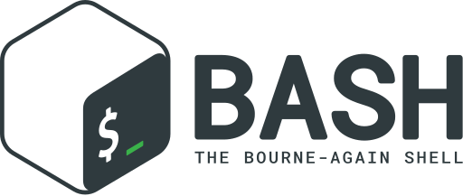
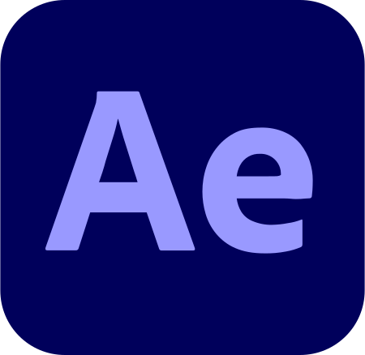

<!----------------------------------- About Section ------------------------------------>
<h3 align="left">Hlw Audience!👋, myself Farhad Dubey</h3>
<h4 align="left">Welcome to my World!</h4>

<h4 align="left">Scripting the Programming World | Passionate about optimized Code with Efficient Algorithms | Insane & Co-operative programmer | Let's build something extraordinary !</h4>

🔭 Currently partially engaged with <b>TDIL Consultancy Services<b/>

👯 Interested to collaborate on <b>Dynamic Projects in the field of AI, ML, DL, Web Apps & Softwares</b> 

👨‍💻 All, my minor projects are available at <b>https://github.com/farhaddubey/</b>

💬 Interested to be consoled regarding <b>Technology, Innovations, Researches, Programming World etc.</b> 

📫 Contact me regarding software projects via <b>ln/farhaddubey/</b>

⚡ Funny👻 facts👻 about me👻: Funny, Friendly, Flirty, a chocolate Hero, Co - operative, Rude, overall Personality with Creativity, with multidimensional thought-process, strict projects oriented mindset & <b>with intellect, creative & Dynamic multidimensional Attitude</b>

  <b><i>Let's connect! & Revolutionize the Future!.</i></b>

<h1 align="center">
  
</h1>
  

&nbsp;&nbsp;
&nbsp;&nbsp;          
  &nbsp;&nbsp;
&nbsp;&nbsp;
 &nbsp;&nbsp;
 

<h3 align="left">Get in Touch:☕</h3>

 

     

<h3 align="left">Programming Languages:</h3>

 
 
 
 
 
  
 

 
       
 
 

 

  

   
  
   
   
    
 

       
<a href="https://www.typescriptlang.org/" target="_blank" rel="noreferrer"> 
      

<h3 align="left">Frontend Development:</h3>

 
 
 
 
 
 
 
 
 
 
 
 
 
 

<h3 align="left">Backend Development:</h3>

 
 
 
 
 
 

<h3 align="left">Softwares/App Development:</h3>

 
   
  
   
  

  
 
 

 

<h3 align="left">AI ML DL Frameworks & Libraries:</h3>

        

<h3 align="left">Database:</h3>

      
  
 

Microservices Architecture:</h3>

      

<h3 align="left">Backend as a Service(Baas):</h3>

  
 

<h3 align="left">Softwares Proficiency:</h3>

   
   </a>   
  
 
 
 
 
  
   
 </a>
 </a>
 </a>
 </a> 

<h3 align="left">Others:</h3>

 
 
 
 

 
---

   
 
  

  

  

<h3>Github Streak :fire:</h3>

  <a href="https://git.io/streak-stats">
    </img>
  </a>

---
<h3>Dimensions :fire:</h3>

---
<h3>Github Batches📊</h3>

  

---

<h3>Github Stats 🌍🌍🌏</h3>
  
 
  
        
        
      
        
 

  

---

---

 
<h3>Popular Projects ❤️‍🔥</h3>

  
   
    

---

---

---

